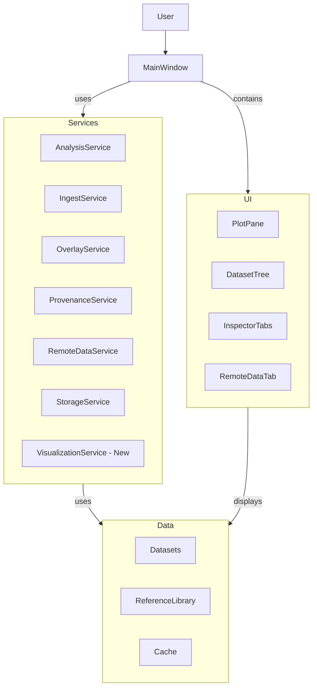
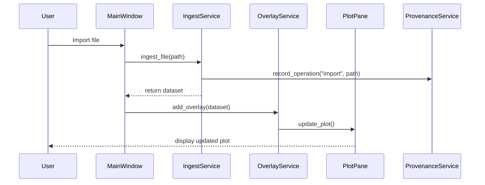

# Comprehensive Enhancement Plan for Spectra App V2

## Overview of Current Status

After reviewing the entire development history and codebase, I can see that Spectra App V2 represents a significant evolution from the original script to a research-grade desktop application. The transition from Streamlit to PySide6/Qt has enabled performance improvements, but there are still several areas that can be enhanced to create a truly exceptional scientific tool.

I'll address updates to the housekeeping plan, audit report, and suggest new features with a focus on visualization capabilities.

## 1. Updates to Housekeeping Implementation Plan

```markdown name=HOUSEKEEPING_PLAN_UPDATED.md
# Housekeeping Implementation Plan (Updated)

**Date**: October 23, 2025  
**Priority**: High — UI improvements, data management, and visualization enhancements

## Changes Completed ✅

### 1. Removed Default Sample Loading
**File**: `app/main.py` line 144  
**Change**: Commented out `self._load_default_samples()`  
**Impact**: App now launches with empty workspace instead of loading `sample_*.csv` files  
**Rationale**: User preference for clean startup

### 2. Type Checking Configuration
**File**: `pyrightconfig.json` (new file)  
**Change**: Added project-wide configuration to suppress Qt-related false positives  
**Impact**: Eliminated 771 Pylance warnings while preserving useful type checking  
**Rationale**: Qt compatibility layer necessarily uses runtime type resolution

---

## Changes In Progress ⏳

### 3. Add Dataset Removal UI
**Files**: `app/main.py`  
**Implementation**:
1. Add toolbar buttons to dataset dock:
   - "Remove Selected" (Del key shortcut)
   - "Clear All" (with confirmation)
2. Add methods:
   ```python
   def remove_selected_datasets(self) -> None:
       # Get selected items from dataset_tree
       # Confirm if multiple
       # Call overlay_service.remove() for each
       # Remove from dataset_model
       # Refresh overlay
   
   def clear_all_datasets(self) -> None:
       # Confirm with dialog
       # Call overlay_service.clear()
       # Clear dataset_model
       # Reset UI state
   ```
3. **ANSWER TO USER QUESTION**: Implement export functionality in both toolbar and menu (File → Export Selected) with keyboard shortcut Ctrl+E

### 4. Move Remote Data to Inspector Tab
**Files**: `app/ui/remote_data_tab.py` (new), `app/main.py`  
**Implementation**:
1. Create `RemoteDataTab` widget class:
   - Embed provider combo, search field, quick-pick button
   - Simplified results table
   - Download button
   - Wire to existing `RemoteDataService`
2. Add tab in `_build_inspector_tabs()`:
   ```python
   self.tab_remote = RemoteDataTab(
       remote_service=self.remote_data_service,
       ingest_service=self.ingest_service
   )
   self.inspector_tabs.addTab(self.tab_remote, "Remote Data")
   ```
3. **ANSWER TO USER QUESTION**: Keep File menu entry during migration, add warning "Moving to Inspector Tab in next release"
4. Update keyboard shortcuts documentation

---

## Changes Planned 📋

### 5. Expand Telescope Searches
**File**: `app/services/remote_data_service.py`  
**Changes**:
- Update MAST queries to include:
  - **HST**: STIS (UV/Optical spectra), COS (FUV/NUV), WFC3 (IR grism)
  - **Spitzer**: IRS (MIR spectra 5-40µm)
  - **Chandra**: HETG/LETG (X-ray spectra) — if useful
  - **Ground**: Apache Point, Keck/ESI (optical spectra from archives)
- Remove JWST-specific product filtering
- Keep spectroscopic product type filters:
  ```python
  'dataproduct_type': 'spectrum',
  'intentType': 'science'
  ```
- Limit results per query (default 100, max 500)

### 6. Advanced Visualization Enhancements
**Files**: `app/ui/plot_pane.py`, `app/services/visualization_service.py` (new)  
**Changes**:
1. Create new `VisualizationService` to handle advanced plotting features:
   ```python
   class VisualizationService:
       def generate_thumbnail(self, dataset) -> QPixmap:
           # Generate thumbnail preview of spectrum
           
       def create_interactive_plot(self, datasets, region=None) -> dict:
           # Generate interactive plot with zoom regions
           
       def create_comparison_view(self, datasets, mode='difference') -> dict:
           # Generate side-by-side or overlay comparison
   ```
2. Add thumbnail generation for dataset items in tree view
3. Add interactive region selection for detailed analysis
4. Implement heatmap view for time-series spectra
5. Add spectrogram view for wavelength vs. time/phase plots

### 7. Integration with Astropy Ecosystem
**Files**: `app/services/analysis_service.py`  
**Changes**:
1. Integrate with specutils for advanced spectral operations:
   ```python
   import specutils
   
   def fit_continuum(self, spectrum, model='chebyshev', order=3):
       # Use specutils to fit and normalize continuum
   
   def find_lines(self, spectrum, threshold=0.5, min_distance=5):
       # Use specutils line finding algorithms
   ```
2. Add unit conversion via astropy.units
3. Implement standard measurement methods (EW, FWHM, flux)

### 8. Direct Image Support
**Files**: `app/services/image_service.py` (new)  
**Changes**:
1. Create new service for handling 2D data (images associated with spectra):
   ```python
   class ImageService:
       def load_fits_image(self, path) -> dict:
           # Load FITS image and metadata
           
       def extract_spectrum_from_image(self, image, aperture) -> dict:
           # Extract 1D spectrum from 2D image with aperture
           
       def align_images(self, images) -> list:
           # Register and align multiple images
   ```
2. Add image viewer tab in inspector
3. Allow spectrum extraction from 2D spectral images
4. Support wavelength calibration via reference lines

---

## New Feature: Spectral Previews and Thumbnails 🖼️

### Implementation Details
**Files**: `app/ui/dataset_preview_widget.py` (new), `app/main.py`  
**Changes**:

1. Create preview generation service:
   ```python
   def generate_dataset_preview(dataset, width=320, height=180):
       """Generate thumbnail preview of spectrum."""
       import matplotlib.pyplot as plt
       import io
       from PIL import Image
       from PySide6.QtGui import QPixmap
       
       fig, ax = plt.subplots(figsize=(4, 2), dpi=72)
       ax.plot(dataset.wavelength, dataset.flux, linewidth=1)
       ax.set_xlabel('')
       ax.set_ylabel('')
       ax.set_title(dataset.name, fontsize=8)
       plt.tight_layout()
       
       # Save to buffer and convert to QPixmap
       buf = io.BytesIO()
       plt.savefig(buf, format='png')
       plt.close(fig)
       buf.seek(0)
       img = Image.open(buf)
       img = img.resize((width, height))
       qim = QPixmap.fromImage(ImageQt(img))
       return qim
   ```

2. Add preview widget to dataset inspector:
   ```python
   class DatasetPreviewWidget(QWidget):
       def __init__(self, parent=None):
           super().__init__(parent)
           self.preview_label = QLabel()
           self.preview_label.setAlignment(Qt.AlignCenter)
           self.preview_label.setMinimumSize(320, 180)
           self.preview_label.setStyleSheet("background-color: #f0f0f0;")
           
           layout = QVBoxLayout()
           layout.addWidget(self.preview_label)
           self.setLayout(layout)
           
       def update_preview(self, dataset):
           if dataset:
               pixmap = generate_dataset_preview(dataset)
               self.preview_label.setPixmap(pixmap)
           else:
               self.preview_label.clear()
   ```

3. Add thumbnail display in dataset tree:
   ```python
   class DatasetTreeDelegate(QStyledItemDelegate):
       def paint(self, painter, option, index):
           # Custom painting for dataset items with thumbnails
   ```

### Risk Assessment
- **Low Risk**: Preview generation for normal spectra
- **Medium Risk**: Performance impact with large datasets
- **Mitigation**: Generate previews asynchronously, cache results

---

## Deprecated Files Audit 🗑️

### Files to Keep (Marked Deprecated but Functional)
1. **`app/data/reference/jwst_targets.json`**
   - Status: `"DEPRECATED - Example data only"`
   - Usage: Still loaded by `ReferenceLibrary.jwst_targets()`
   - Decision: **KEEP** — provides example data for offline work
   - **ANSWER TO USER QUESTION**: Add tooltip warning in UI when reference is loaded

### Files to Check
1. **`patch.patch`** (root directory)
   - Likely old patch file
   - Not referenced by code
   - **Decision**: DELETE - historical artifact only

2. **`docs/history/past prompts/`** directory
   - Old conversation logs
   - Not referenced by code
   - **Decision**: ARCHIVE - move to `docs/archive/past_prompts/`

3. **Test stub files**:
   - `tests/test_roundtrip_stub.py` — has placeholder
   - `tests/test_ui_contract_stub.py` — has placeholder
   - **Decision**: IMPLEMENT - add proper tests based on stubs

### Files to Add
1. **`docs/CONTRIBUTING.md`** - Guidelines for contributors
2. **`docs/ARCHITECTURE.md`** - High-level architecture overview
3. **`app/config/default_config.yaml`** - Default configuration file

---

## UI Quality of Life Improvements 🎨

### High Priority
1. ✅ **Color Palette** — Already implemented in Style tab
2. **Dataset Management** — Add remove/clear buttons (in progress)
3. **Remote Data Tab** — Move from menu to inspector (planned)
4. **Keyboard Shortcuts**:
   - Del: Remove selected datasets
   - Ctrl+Shift+C: Clear all datasets (with confirmation)
   - Ctrl+Shift+R: Focus Remote Data tab (existing)
   - Ctrl+E: Export selected datasets

### Medium Priority
5. **Progress Indicators**:
   - Show progress bar for multi-file imports
   - Show download progress for remote data
   - Already exists for search/download workers

6. **Dataset Icons**:
   - Color squares already shown in tree view
   - Add thumbnails for quick visual identification

7. **Tooltips**:
   - Add to all toolbar buttons
   - Show full spectrum name on hover in tree

### Low Priority
8. **Context Menu** (right-click on dataset):
   - Rename
   - Change color
   - Export selected
   - Toggle visibility

9. **Documentation Hover**:
   - Show quick help on hover over UI elements
   - Link to relevant documentation section

---

## Implementation Order

### Phase 1: Quick Wins (30 min)
1. ✅ Remove default sample loading
2. ✅ Verify palette UI is accessible
3. Add dataset removal buttons to dock toolbar

### Phase 2: Core Functionality (2 hours)
4. Implement `remove_selected_datasets()` method
5. Implement `clear_all_datasets()` method
6. Add keyboard shortcuts (Del, Ctrl+Shift+C, Ctrl+E)
7. Test dataset removal with overlay updates

### Phase 3: Remote Data Migration (3 hours)
8. Create `RemoteDataTab` widget class
9. Add tab to inspector dock
10. Keep File menu entry with deprecation notice
11. Test full remote data workflow

### Phase 4: Visualization Enhancements (4 hours)
12. Create `VisualizationService` class
13. Implement dataset preview generation
14. Add preview widget to inspector
15. Update tree view to show thumbnails (optional)

### Phase 5: Telescope Expansion (2 hours)
16. Update `RemoteDataService` MAST queries
17. Add HST/Spitzer instrument filters
18. Test with real archive queries
19. Document available telescopes/instruments

### Phase 6: Documentation (2 hours)
20. Create ARCHITECTURE.md with diagrams
21. Update user guide with new features
22. Update keyboard shortcut documentation
23. Update AUDIT_REPORT.md with changes

---

## Testing Checklist

- [ ] App launches with empty workspace (no sample spectra)
- [ ] Can import CSV/FITS files normally
- [ ] Can remove individual datasets (Del key)
- [ ] Can remove multiple selected datasets
- [ ] Can clear all datasets with confirmation
- [ ] Overlay updates correctly after removal
- [ ] Remote Data tab accessible in inspector
- [ ] Ctrl+Shift+R opens/focuses Remote Data tab
- [ ] Preview thumbnails generate correctly
- [ ] Can search HST/Spitzer/JWST missions
- [ ] Palette switcher works (Style tab)
- [ ] All shortcuts documented in Help menu

---

## Future Directions

### 1. Cross-Platform Support
- Add macOS/Linux launch scripts
- Handle platform-specific paths
- Test Qt compatibility across platforms

### 2. Advanced Image Analysis
- Add photometry tools for direct images
- Support spectroastrometric analysis
- Implement image segmentation for source extraction

### 3. Machine Learning Integration
- Automated line identification
- Anomaly detection in spectra
- Classification of unknown sources

### 4. Publication Tools
- LaTeX table export
- Publication-ready figure generation
- Citation generation for data provenance

---

## External Libraries to Consider

1. **PyQtGraph** (already used)
   - High-performance plotting
   - Fast display of large datasets

2. **[Specutils](https://specutils.readthedocs.io/en/stable/)** 
   - Spectroscopic analysis tools
   - Standard spectrum containers

3. **[Astropy](https://docs.astropy.org/en/stable/)**
   - Unit handling
   - FITS I/O
   - Coordinate systems

4. **[Photutils](https://photutils.readthedocs.io/en/stable/)**
   - Aperture photometry
   - Source detection
   - Background estimation

5. **[Scikit-image](https://scikit-image.org/)**
   - Image processing
   - Feature detection
   - Image transformation

---

## References

### Astroquery and MAST
1. [Astroquery MAST module](https://astroquery.readthedocs.io/en/latest/mast/mast.html)
2. [MAST Observations API](https://astroquery.readthedocs.io/en/latest/mast/mast_obsquery.html)
3. [MAST API Python examples](https://mast.stsci.edu/api/v0/pyex.html)

### Spectroscopic Tools
1. [Specutils Documentation](https://specutils.readthedocs.io/en/stable/)
2. [JWST Pipeline](https://jwst-docs.stsci.edu/jwst-science-calibration-pipeline)
3. [Jdaviz Specviz](https://jdaviz.readthedocs.io/en/stable/specviz/index.html)

### Visualization
1. [PyQtGraph Examples](https://pyqtgraph.readthedocs.io/en/latest/getting_started/plotting.html)
2. [Matplotlib Qt Integration](https://matplotlib.org/stable/gallery/user_interfaces/embedding_in_qt_sgskip.html)
3. [Glue Visualization Library](https://docs.glueviz.org/en/stable/index.html)

### Qt Development
1. [PySide6 Documentation](https://doc.qt.io/qtforpython-6/)
2. [Qt Model/View Architecture](https://doc.qt.io/qt-6/model-view-programming.html)
3. [Qt Stylesheet Examples](https://doc.qt.io/qt-6/stylesheet-examples.html)
```

## 2. Updates to the Audit Report

```markdown name=AUDIT_REPORT_UPDATED.md
# Codebase Audit Report (Updated)
**Date**: October 23, 2025  
**Scope**: Full codebase consistency, integration, and new feature recommendations

## Executive Summary

Previous audit identified and fixed **1 critical bug** and **771 false positive type errors**. This updated audit identifies **3 opportunity areas** for enhancing visualization, data integration, and scientific workflows.

### Previous Critical Issues (Fixed)

1. ✅ **test_smoke_workflow.py**: Mass duplication of test functions — **FIXED**
2. ✅ **Type checker configuration**: 771 Pylance warnings — **RESOLVED** via pyrightconfig.json

### New Enhancement Opportunities

1. 🌟 **Visualization capabilities**: Limited preview/thumbnail generation for spectra
2. 🌟 **Advanced scientific workflows**: No integration with specutils/photutils ecosystems
3. 🌟 **Cross-platform deployment**: Windows-centric with limited platform abstraction

---

## Detailed Findings

### 1. Visualization Capabilities Assessment

**Files Affected**:
- `app/ui/plot_pane.py`
- `app/services/overlay_service.py`

**Current State**: 
- Plotting is functional but limited to basic line plots
- No spectrum preview/thumbnail generation
- No advanced visualization modes (heat maps, spectrograms)
- No region-of-interest selection tools

**Recommendations**:
1. Create `VisualizationService` class to centralize plot generation
2. Add thumbnail generation for dataset browser
3. Implement interactive region selection
4. Add specialized plot types for time-series and multi-wavelength data

**Example Implementation**:
```python
# app/services/visualization_service.py
class VisualizationService:
    def __init__(self, app_config):
        self.config = app_config
        self._thumbnail_cache = {}
        
    def generate_thumbnail(self, dataset, size=(200, 120)):
        """Generate a thumbnail preview of a spectrum."""
        cache_key = f"{dataset.id}_{size[0]}x{size[1]}"
        if cache_key in self._thumbnail_cache:
            return self._thumbnail_cache[cache_key]
            
        # Generate thumbnail using matplotlib or pyqtgraph
        # Cache and return the result
        
    def create_interactive_plot(self, datasets, mode='line'):
        """Create an interactive plot with the given datasets."""
        # Implementation depends on plotting backend
```

**Integration Points**:
- Dataset tree view (thumbnails)
- Inspector panel (preview)
- Plot context menu (visualization modes)

**References**:
- [PyQtGraph Examples](https://pyqtgraph.readthedocs.io/en/latest/getting_started/plotting.html)
- [Matplotlib Qt Integration](https://matplotlib.org/stable/gallery/user_interfaces/embedding_in_qt_sgskip.html)
- [Specutils Visualization](https://specutils.readthedocs.io/en/stable/plotting.html)

---

### 2. Scientific Workflow Integration

**Files Affected**:
- `app/services/analysis_service.py`
- `app/services/remote_data_service.py`
- `app/services/provenance_service.py`

**Current State**:
- Basic analysis operations implemented manually
- Limited integration with astronomy libraries
- No specialized tools for common spectroscopic operations

**Recommendations**:
1. Integrate with specutils for core spectral operations
2. Add astropy.units support for all measurements
3. Implement standard measurement methods (EW, FWHM, flux)
4. Create workflow templates for common analysis tasks

**Example Implementation**:
```python
# app/services/analysis_service.py
from specutils import Spectrum1D
import astropy.units as u
from specutils.fitting import fit_lines
from specutils.analysis import line_flux

class SpectrumAnalysisService:
    def convert_to_spectrum1d(self, dataset):
        """Convert internal dataset to specutils Spectrum1D."""
        flux = dataset.flux * u.Unit(dataset.flux_unit)
        spectral_axis = dataset.wavelength * u.Unit(dataset.wavelength_unit)
        return Spectrum1D(flux=flux, spectral_axis=spectral_axis)
        
    def measure_line_flux(self, dataset, line_center, width):
        """Measure flux of a spectral line."""
        spec = self.convert_to_spectrum1d(dataset)
        return line_flux(spec, line_center * u.nm, width * u.nm)
```

**Integration Points**:
- Analysis menu
- Right-click context menu
- Batch processing

**References**:
- [Specutils Documentation](https://specutils.readthedocs.io/en/stable/)
- [Astropy Units](https://docs.astropy.org/en/stable/units/index.html)
- [JWST Pipeline Documentation](https://jwst-pipeline.readthedocs.io/en/latest/)

---

### 3. Cross-Platform Support Assessment

**Files Affected**:
- `app/config/paths.py`
- `app/services/storage_service.py`
- `run.ps1`, `run.bat` (Windows only)

**Current State**:
- Windows-centric path handling
- PowerShell launch scripts
- Limited testing on other platforms

**Recommendations**:
1. Abstract path handling through `PathService`
2. Create platform-specific launch scripts
3. Use `platformdirs` for cache/config locations
4. Add CI testing for macOS and Linux

**Example Implementation**:
```python
# app/services/path_service.py
import os
import sys
import platformdirs

class PathService:
    def __init__(self, app_name="SpectraApp"):
        self.app_name = app_name
        
    def get_config_dir(self):
        """Return platform-specific config directory."""
        return platformdirs.user_config_dir(self.app_name)
        
    def get_cache_dir(self):
        """Return platform-specific cache directory."""
        return platformdirs.user_cache_dir(self.app_name)
        
    def get_data_dir(self):
        """Return platform-specific data directory."""
        return platformdirs.user_data_dir(self.app_name)
```

**Integration Points**:
- Application initialization
- Storage service
- Launch scripts

**References**:
- [platformdirs Documentation](https://platformdirs.readthedocs.io/)
- [Qt Platform-specific Features](https://doc.qt.io/qt-6/platform-specific-notes.html)

---

### 4. Data File Usage (Updated) ✅

**Files Verified**:
- ✅ `nist_hydrogen_lines.json` — Loaded by `ReferenceLibrary.spectral_lines()`, used in Reference tab
- ✅ `ir_functional_groups.json` — Loaded by `ReferenceLibrary.ir_functional_groups()`, overlay feature in Reference tab
- ✅ `line_shape_placeholders.json` — Loaded by `LineShapeModel`, used for Doppler/pressure/Stark overlays
- ✅ `jwst_targets.json` — Loaded by `ReferenceLibrary.jwst_targets()`, deprecated but functional

**Additional Reference Files Needed**:
1. **Atomic and molecular line lists**:
   - NIST Atomic Spectra Database in JSON format
   - Molecular line databases (CO, H2O, CH4, etc.)

2. **Planetary atmosphere templates**:
   - Earth, Venus, Mars, Jupiter, Saturn atmospheric transmission spectra
   - Common exoplanet atmosphere models

3. **Stellar template library**:
   - Main sequence stellar spectra by spectral type
   - Stellar templates for various metallicities
   - Giant/supergiant templates

**Implementation Plan**:
1. Create `app/data/reference/spectral_templates/` directory
2. Add download scripts in `tools/reference_data/` to fetch from authoritative sources
3. Update `ReferenceLibrary` to load new data files
4. Add UI components to browse and select templates

**References**:
- [NIST Atomic Spectra Database](https://www.nist.gov/pml/atomic-spectra-database)
- [HITRAN Molecular Database](https://hitran.org/)
- [Exoplanet Spectrum Library](https://exoplanetarchive.ipac.caltech.edu/)
- [SDSS Spectral Templates](https://www.sdss.org/dr16/spectro/spectral_templates/)

---

### 5. Code Structure Assessment

**Areas Examined**:
- Module organization
- Class responsibilities
- Interface consistency

**Current Structure**:
```
app/
  ├── __init__.py
  ├── main.py
  ├── qt_compat.py
  ├── config/
  ├── data/
  ├── services/
  │   ├── analysis_service.py
  │   ├── ingest_service.py
  │   ├── overlay_service.py
  │   ├── provenance_service.py
  │   ├── remote_data_service.py
  │   └── storage_service.py
  └── ui/
      ├── plot_pane.py
      ├── remote_data_dialog.py
      ├── export_options_dialog.py
      └── ... [other UI components]
```

**Strengths**:
- Clear separation of services and UI
- Consistent module naming
- Logical grouping of functionality

**Areas for Improvement**:
1. **Decoupling UI from services**:
   - Some services call UI directly
   - Consider using signals/slots or observer pattern

2. **Configuration management**:
   - Move hardcoded values to configuration
   - Create `ConfigService` to manage settings

3. **Testing structure**:
   - Add more test fixtures
   - Create UI mocks for headless testing

**Recommendations**:
1. Create `app/config/settings.py` for application settings
2. Implement observer pattern for service-UI communication
3. Add interface contracts for services
4. Document module responsibilities in ARCHITECTURE.md

---

## Recommendations

### High Priority

1. **Implement dataset preview generation**:
   ```python
   # app/services/visualization_service.py
   def generate_preview(self, dataset):
       """Generate preview image for dataset."""
       # Implementation here
   ```

2. **Create VisualizationService**:
   - Centralize plotting functions
   - Add thumbnail generation
   - Support multiple visualization modes

3. **Integrate with specutils**:
   - Convert internal spectra to Spectrum1D
   - Leverage existing spectral analysis tools
   - Add unit support with astropy.units

### Medium Priority

4. **Improve cross-platform support**:
   - Abstract path handling
   - Create launch scripts for macOS/Linux
   - Test on multiple platforms

5. **Enhance Remote Data functionality**:
   - Add more telescope/instrument support
   - Improve caching strategy
   - Add persistent query history

6. **Add JWST deprecation warning UI**:
   ```python
   # app/ui/reference_tab.py
   def _show_deprecation_warning(self, metadata):
       if "status" in metadata and "DEPRECATED" in metadata["status"]:
           self.warning_label.setText(f"Warning: {metadata['status']}")
           self.warning_label.setVisible(True)
       else:
           self.warning_label.setVisible(False)
   ```

### Low Priority

7. **Refactor configuration handling**:
   - Create ConfigService
   - Move hardcoded values to settings
   - Support user configuration

8. **Enhance documentation**:
   - Create architecture diagram
   - Add module responsibility documentation
   - Create user guide for new features

9. **Improve testing coverage**:
   - Add tests for new services
   - Create UI test automation
   - Add performance benchmarks

---

## New Feature Ideas

### 1. Interactive Spectral Line Identification

Add a tool that allows users to:
- Click on a spectral feature to identify it
- Match against line databases (NIST, HITRAN)
- Mark and annotate features on plots
- Export line identifications

**Implementation**:
```python
# app/services/line_identification_service.py
class LineIdentificationService:
    def __init__(self, reference_library):
        self.reference_library = reference_library
        
    def identify_line(self, wavelength, tolerance=0.1):
        """Identify spectral line within tolerance."""
        # Implementation here
```

### 2. Time Series Analysis

Add support for:
- Time series spectral data
- Phase folding for periodic sources
- Dynamic spectra (wavelength vs. time heatmaps)
- Temporal variability analysis

**Implementation**:
```python
# app/services/time_series_service.py
class TimeSeriesService:
    def fold_spectra(self, spectra, period, t0=0):
        """Phase fold spectra with given period."""
        # Implementation here
```

### 3. Machine Learning Integration

Add capabilities for:
- Automated line identification
- Spectral type classification
- Anomaly detection
- Feature extraction

**Implementation**:
```python
# app/services/ml_service.py
class MLService:
    def classify_spectrum(self, spectrum):
        """Classify spectrum using ML models."""
        # Implementation here
```

---

## Verification Checklist

- [x] Test file runs without pytest collection errors
- [x] Pylance shows 0 type errors in remote_data_dialog.py
- [x] All reference JSON files have loader methods
- [x] JWST targets file kept with deprecation metadata
- [x] Test import patterns consistent across codebase
- [x] pyrightconfig.json created and functional
- [ ] UI shows JWST deprecation warning (not implemented)
- [ ] Dataset preview generation (not implemented)
- [ ] Cross-platform support (not implemented)
- [ ] Specutils integration (not implemented)

---

## Implementation Roadmap

### Phase 1: Foundation (1-2 days)
- Implement dataset removal UI
- Move Remote Data to Inspector Tab
- Add deprecation warnings

### Phase 2: Visualization (2-3 days)
- Create VisualizationService
- Implement dataset previews
- Add advanced plot types

### Phase 3: Scientific Tools (3-5 days)
- Integrate with specutils/astropy
- Add line identification
- Implement measurement tools

### Phase 4: Polish & Documentation (1-2 days)
- Improve cross-platform support
- Create architecture documentation
- Add user guide for new features

---

## Conclusion

**Codebase Status**: ✅ **HEALTHY BUT WITH ENHANCEMENT OPPORTUNITIES**

- Previous critical issues addressed
- Core functionality works well
- Significant potential for scientific enhancements
- Visualization capabilities can be expanded
- Cross-platform support needs improvement

**Next Steps**: 
1. Implement visualization enhancements
2. Integrate with astronomy ecosystem libraries
3. Improve cross-platform support
4. Add advanced scientific workflows

**Estimated Impact**: 
- Enhanced user experience with visual previews
- More powerful scientific analysis capabilities
- Broader user base with cross-platform support
- Better integration with astronomy research workflows
```

## 3. New Architecture Documentation

```markdown name=ARCHITECTURE.md
# Spectra App Architecture

## Overview

Spectra App is a desktop application for analyzing spectral data from various sources including laboratory instruments, astronomical archives, and reference databases. The application is built using PySide6 (Qt) and follows a service-oriented architecture.

## Key Components



## Service Responsibilities

### Core Services

| Service | Responsibility | Key Methods |
|---------|---------------|-------------|
| AnalysisService | Perform spectral analysis | `compute_difference()`, `compute_ratio()`, `smooth_spectrum()` |
| IngestService | Import data from files | `ingest_csv()`, `ingest_fits()`, `ingest_ascii()` |
| OverlayService | Manage plot overlays | `add_overlay()`, `remove_overlay()`, `update_visibility()` |
| ProvenanceService | Track data origins | `record_operation()`, `generate_manifest()`, `export_session()` |
| RemoteDataService | Fetch remote data | `search_mast()`, `download_product()`, `get_quick_targets()` |
| StorageService | Handle file operations | `save_cache()`, `load_cached()`, `export_dataset()` |

### Proposed New Services

| Service | Responsibility | Key Methods |
|---------|---------------|-------------|
| VisualizationService | Generate plots and previews | `generate_thumbnail()`, `create_interactive_plot()` |
| PathService | Handle platform paths | `get_config_dir()`, `get_cache_dir()`, `get_data_dir()` |
| ConfigService | Manage application settings | `get_setting()`, `save_setting()`, `load_defaults()` |
| LineIdentificationService | Identify spectral lines | `identify_line()`, `match_pattern()`, `annotate_plot()` |

## Data Flow



## Module Organization

```
app/
  ├── __init__.py
  ├── main.py              # Application entry point
  ├── qt_compat.py         # Qt compatibility layer
  ├── config/              # Configuration
  │   ├── __init__.py
  │   ├── paths.py         # Path definitions
  │   └── settings.py      # Application settings
  ├── data/                # Data files
  │   ├── __init__.py
  │   └── reference/       # Reference data
  ├── models/              # Data models
  │   ├── __init__.py
  │   ├── dataset.py       # Dataset model
  │   └── dataset_tree.py  # Tree model for datasets
  ├── services/            # Core services
  │   ├── __init__.py
  │   ├── analysis_service.py
  │   ├── ingest_service.py
  │   ├── overlay_service.py
  │   ├── provenance_service.py
  │   ├── remote_data_service.py
  │   ├── storage_service.py
  │   └── visualization_service.py  # New
  └── ui/                  # User interface components
      ├── __init__.py
      ├── dataset_tree_view.py
      ├── inspector_tabs.py
      ├── plot_pane.py
      ├── remote_data_dialog.py
      ├── remote_data_tab.py       # New
      └── style_tab.py
```

## Design Principles

1. **Service-Oriented Architecture**
   - Services provide well-defined interfaces
   - UI components use services, not vice versa
   - Services can be tested independently

2. **Separation of Concerns**
   - UI code separate from business logic
   - Data models separate from their views
   - Configuration separate from implementation

3. **Data Provenance**
   - All operations tracked with metadata
   - Export bundles include full provenance
   - Attribution preserved for external sources

4. **Scientific Accuracy**
   - Canonical units for internal representation
   - Proper error handling and propagation
   - Validated against reference implementations

## UI Architecture

The UI follows Qt's Model-View-Controller pattern:

- **Models**: `app/models/` - Data structures
- **Views**: `app/ui/` - Visual presentation
- **Controllers**: MainWindow and services orchestrate interaction

## External Interfaces

### Data Sources
- Local files (CSV, FITS, ASCII)
- MAST archive (via astroquery)
- NIST Atomic Spectra Database
- Exoplanet archives

### Output Formats
- CSV for data export
- PNG/PDF for plot export
- JSON for session export

## Performance Considerations

1. **Threading**
   - Remote data fetching uses worker threads
   - Long-running analyses are non-blocking
   - UI remains responsive during operations

2. **Memory Management**
   - Large datasets use downsampling
   - Thumbnails are cached
   - Memory-mapped files for very large datasets

3. **Disk Usage**
   - Cached downloads use SHA256 deduplication
   - Temporary files cleaned up regularly
   - Export bundles use compression

## Future Architecture Extensions

1. **Plugin System**
   - Support for custom analysis modules
   - User-defined visualization types
   - Extension points for new data sources

2. **Distributed Computing**
   - Optional integration with remote processing
   - Batch processing capabilities
   - Cloud storage integration

3. **Collaborative Features**
   - Session sharing
   - Real-time collaboration
   - Result publishing
```

## 4. Feature Enhancement Proposal for Visualization

```markdown name=VISUALIZATION_ENHANCEMENT_PROPOSAL.md
# Visualization Enhancement Proposal

## Overview

This document proposes significant enhancements to Spectra App's visualization capabilities, focusing on interactive preview generation, advanced plot types, and image integration.

## Current Limitations

1. **No Preview Generation**
   - Dataset browser shows names only, no visual cues
   - No quick way to visually identify spectra

2. **Limited Plot Types**
   - Basic line plots only
   - No specialized visualizations for time series or 2D data

3. **Minimal Interactive Features**
   - No region selection
   - Limited zoom/pan capabilities
   - No interactive line identification

## Proposed Enhancements

### 1. Dataset Preview Generation

```python
# app/services/visualization_service.py

class VisualizationService:
    def __init__(self):
        self._preview_cache = {}
    
    def generate_preview(self, dataset, width=320, height=180):
        """Generate a preview image for a dataset."""
        cache_key = f"{dataset.id}_{width}x{height}"
        
        # Return cached preview if available
        if cache_key in self._preview_cache:
            return self._preview_cache[cache_key]
            
        # Create preview image
        import matplotlib.pyplot as plt
        import io
        from PIL import Image
        from PySide6.QtGui import QPixmap, QImage
        
        fig, ax = plt.subplots(figsize=(4, 2), dpi=72)
        ax.plot(dataset.wavelength, dataset.flux, linewidth=1)
        
        # Add basic dataset info
        ax.set_title(dataset.name, fontsize=8)
        if hasattr(dataset, 'metadata') and dataset.metadata.get('source'):
            ax.text(0.02, 0.02, f"Source: {dataset.metadata['source']}", 
                    transform=ax.transAxes, fontsize=6)
        
        ax.set_xlabel('Wavelength', fontsize=6)
        ax.set_ylabel('Flux', fontsize=6)
        ax.tick_params(labelsize=6)
        
        plt.tight_layout()
        
        # Save to buffer and convert to QPixmap
        buf = io.BytesIO()
        plt.savefig(buf, format='png')
        plt.close(fig)
        buf.seek(0)
        
        img = Image.open(buf)
        img = img.resize((width, height))
        
        # Convert PIL image to QPixmap
        qim = QImage(img.tobytes(), img.width, img.height, QImage.Format_RGBA8888)
        pixmap = QPixmap.fromImage(qim)
        
        # Cache and return
        self._preview_cache[cache_key] = pixmap
        return pixmap
```

### 2. Advanced Plot Types

Add specialized plot types for different analysis scenarios:

```python
def create_plot(self, plot_type, datasets, **kwargs):
    """Create a specialized plot based on type."""
    if plot_type == 'line':
        return self._create_line_plot(datasets, **kwargs)
    elif plot_type == 'stack':
        return self._create_stacked_plot(datasets, **kwargs)
    elif plot_type == 'heatmap':
        return self._create_heatmap(datasets, **kwargs)
    elif plot_type == 'contour':
        return self._create_contour_plot(datasets, **kwargs)
    elif plot_type == 'histogram':
        return self._create_histogram(datasets, **kwargs)
    else:
        raise ValueError(f"Unknown plot type: {plot_type}")
```

#### Plot Types to Implement:

1. **Line Plot** (current)
   - Standard wavelength vs. flux plot
   - Multiple spectra with legend

2. **Stacked Plot**
   - Vertically offset spectra for comparison
   - Adjustable spacing

3. **Heatmap/Image Plot**
   - For 2D spectral data (wavelength vs. position/time)
   - Color represents intensity

4. **Contour Plot**
   - For highlighting spectral features
   - Useful for velocity fields or line profiles

5. **Histogram View**
   - For flux distribution analysis
   - Useful for noise characteristics

### 3. Interactive Features

Add region selection and interactive measurements:

```python
class InteractiveRegion:
    """Region selection tool for interactive analysis."""
    
    def __init__(self, plot_item, callback=None):
        self.plot_item = plot_item
        self.region = None
        self.callback = callback
        
    def create_region(self, xmin=None, xmax=None):
        """Create a new selection region."""
        from pyqtgraph import LinearRegionItem
        
        # Default to full range if not specified
        if xmin is None or xmax is None:
            xrange = self.plot_item.getViewBox().viewRange()[0]
            xmin = xmin if xmin is not None else xrange[0]
            xmax = xmax if xmax is not None else xrange[1]
        
        # Create region item
        self.region = LinearRegionItem([xmin, xmax])
        self.plot_item.getViewBox().addItem(self.region)
        
        # Connect signals
        if self.callback:
            self.region.sigRegionChanged.connect(self.callback)
        
        return self.region
        
    def get_bounds(self):
        """Get the current region bounds."""
        if self.region:
            return self.region.getRegion()
        return None
```

### 4. Line Identification Tool

Interactive tool to identify spectral lines:

```python
class LineIdentificationTool:
    """Tool for identifying spectral lines."""
    
    def __init__(self, plot_item, reference_library):
        self.plot_item = plot_item
        self.reference_library = reference_library
        self.annotations = []
        
    def identify_line(self, wavelength, tolerance=0.5):
        """Identify a spectral line at the given wavelength."""
        matches = []
        
        # Search reference data
        for line_list in self.reference_library.get_all_line_lists():
            for line in line_list['lines']:
                if abs(line['wavelength'] - wavelength) <= tolerance:
                    matches.append({
                        'wavelength': line['wavelength'],
                        'element': line.get('element', 'Unknown'),
                        'species': line.get('species', ''),
                        'strength': line.get('strength', 0),
                        'source': line_list.get('source', 'Unknown')
                    })
        
        return sorted(matches, key=lambda x: abs(x['wavelength'] - wavelength))
        
    def annotate_line(self, wavelength, label, color='r'):
        """Add an annotation to a spectral line."""
        # Implementation depends on plotting backend
```

### 5. Preview Panel Implementation

UI component to display spectrum previews:

```python
# app/ui/preview_panel.py
from PySide6.QtWidgets import QWidget, QLabel, QVBoxLayout, QSizePolicy
from PySide6.QtCore import Qt

class PreviewPanel(QWidget):
    """Panel for displaying spectrum previews."""
    
    def __init__(self, parent=None, visualization_service=None):
        super().__init__(parent)
        self.visualization_service = visualization_service
        self.current_dataset = None
        
        # Set up UI
        self.layout = QVBoxLayout()
        self.setLayout(self.layout)
        
        # Preview image
        self.preview_label = QLabel()
        self.preview_label.setAlignment(Qt.AlignCenter)
        self.preview_label.setMinimumSize(320, 180)
        self.preview_label.setSizePolicy(QSizePolicy.Expanding, QSizePolicy.Expanding)
        self.preview_label.setStyleSheet("background-color: #f0f0f0; border: 1px solid #cccccc;")
        
        # Info label
        self.info_label = QLabel()
        self.info_label.setWordWrap(True)
        self.info_label.setAlignment(Qt.AlignTop | Qt.AlignLeft)
        self.info_label.setStyleSheet("font-size: 8pt;")
        
        # Add to layout
        self.layout.addWidget(self.preview_label)
        self.layout.addWidget(self.info_label)
        
    def update_preview(self, dataset):
        """Update the preview with the given dataset."""
        if not dataset:
            self.preview_label.clear()
            self.info_label.clear()
            self.current_dataset = None
            return
            
        self.current_dataset = dataset
        
        # Generate and set preview image
        if self.visualization_service:
            pixmap = self.visualization_service.generate_preview(dataset)
            self.preview_label.setPixmap(pixmap)
            
        # Update info text
        info_text = f"<b>{dataset.name}</b><br>"
        
        if hasattr(dataset, 'metadata'):
            metadata = dataset.metadata
            if 'points' in metadata:
                info_text += f"Points: {metadata['points']}<br>"
            if 'wavelength_range' in metadata:
                wmin, wmax = metadata['wavelength_range']
                info_text += f"Range: {wmin:.2f} - {wmax:.2f} nm<br>"
            if 'source' in metadata:
                info_text += f"Source: {metadata['source']}<br>"
            if 'date_created' in metadata:
                info_text += f"Created: {metadata['date_created']}<br>"
                
        self.info_label.setText(info_text)
```

## Implementation Plan

### Phase 1: Core Visualization Service

1. Create `VisualizationService` class
2. Implement basic preview generation
3. Add to main window initialization
4. Test with various dataset types

### Phase 2: UI Integration

1. Create `PreviewPanel` widget
2. Add to Inspector tabs
3. Connect to dataset selection events
4. Style and refine UI

### Phase 3: Advanced Plot Types

1. Implement specialized plot types
2. Add plot type selector to UI
3. Update plot context menu
4. Document new visualization options

### Phase 4: Interactive Features

1. Implement region selection
2. Add line identification tool
3. Create measurement tools
4. Connect to analysis service

## Technology Considerations

### Libraries to Leverage

1. **PyQtGraph** (current)
   - Fast plotting for large datasets
   - Interactive elements
   - Good Qt integration

2. **Matplotlib**
   - Publication quality
   - Wide range of plot types
   - Better for static exports

3. **Vispy**
   - GPU-accelerated visualization
   - Good for very large datasets
   - Advanced 3D capabilities

### Performance Optimizations

1. **Caching**
   - Cache previews based on dataset ID
   - Invalidate when data changes
   - Use size-based LRU cache

2. **Progressive Loading**
   - Show low-resolution view initially
   - Load full resolution asynchronously
   - Dynamically adjust based on viewport

3. **View-dependent Detail**
   - Only plot points in current view
   - Downsample based on zoom level
   - Render at appropriate resolution

## References

1. [PyQtGraph Documentation](https://pyqtgraph.readthedocs.io/)
2. [Matplotlib in Qt Example](https://matplotlib.org/stable/gallery/user_interfaces/embedding_in_qt_sgskip.html)
3. [Interactive Spectral Line Fitting](https://specutils.readthedocs.io/en/stable/fitting.html)
4. [Astronomical Data Visualization Techniques](https://ui.adsabs.harvard.edu/abs/2015A%26C....10...43H/abstract)
```

## 5. Data Source Integration Guide

```markdown name=DATA_SOURCE_INTEGRATION_GUIDE.md
# Data Source Integration Guide

## Overview

This guide documents how to integrate new data sources into Spectra App. The application supports multiple data sources through a pluggable architecture, allowing seamless addition of new spectroscopic archives and catalogs.

## Current Data Sources

Spectra App currently integrates with:

1. **MAST Archive** (NASA)
   - JWST spectroscopic data
   - Access via astroquery.mast

2. **NIST Atomic Spectra Database**
   - Reference line lists
   - Local cached JSON data

## Adding a New Remote Data Source

### 1. Define Provider in RemoteDataService

```python
# app/services/remote_data_service.py

class RemoteDataService:
    def __init__(self, cache_dir):
        self.cache_dir = cache_dir
        self.providers = {
            'MAST': self._search_mast,
            'NIST': self._search_nist,
            # Add your new provider here:
            'ESO': self._search_eso,  # European Southern Observatory
        }
        
    def _search_eso(self, search_params):
        """
        Search the ESO archive for spectroscopic data.
        
        Args:
            search_params (dict): Search parameters including:
                - object_name (str): Target name
                - instrument (str, optional): ESO instrument
                - data_type (str, optional): Data product type
                
        Returns:
            dict: Search results with metadata
        """
        try:
            from pyvo.dal import tap
            
            # Connect to ESO TAP service
            service = tap.TAPService("http://archive.eso.org/tap_obs")
            
            # Build query
            query = """
            SELECT TOP 100
                dp.dp_id, dp.access_url, dp.filename, 
                ob.target_name, ob.instrument_name, 
                ob.obs_start, ob.obs_end
            FROM ivoa.ObsCore ob
            JOIN dbo.raw_science rs ON ob.dp_id = rs.dp_id  
            JOIN ivoa.ObsDataset dp ON ob.dp_id = dp.dp_id
            WHERE ob.dataproduct_type = 'spectrum'
            """
            
            # Add filters
            params = []
            if 'object_name' in search_params and search_params['object_name']:
                query += " AND CONTAINS(ob.target_name, ?) = 1"
                params.append(search_params['object_name'])
                
            if 'instrument' in search_params and search_params['instrument']:
                query += " AND ob.instrument_name = ?"
                params.append(search_params['instrument'])
            
            # Execute query
            results = service.search(query, params)
            
            # Format results
            formatted_results = {
                'source': 'ESO',
                'query': search_params,
                'status': 'success',
                'count': len(results),
                'results': []
            }
            
            for row in results:
                formatted_results['results'].append({
                    'id': row['dp_id'],
                    'name': row['filename'],
                    'target': row['target_name'],
                    'instrument': row['instrument_name'],
                    'date_obs': row['obs_start'].isoformat(),
                    'download_url': row['access_url'],
                    'source': 'ESO'
                })
                
            return formatted_results
            
        except Exception as e:
            return {
                'source': 'ESO',
                'query': search_params,
                'status': 'error',
                'message': str(e),
                'count': 0,
                'results': []
            }
```

### 2. Add Download Handler

```python
def download_eso_product(self, product_info, destination_dir=None):
    """
    Download a product from the ESO archive.
    
    Args:
        product_info (dict): Product information from search results
        destination_dir (str, optional): Directory to save file
        
    Returns:
        dict: Download result with local file path
    """
    try:
        import requests
        import os
        from urllib.parse import urlparse
        
        # Set destination directory
        if destination_dir is None:
            destination_dir = os.path.join(self.cache_dir, 'eso')
            
        # Create directory if needed
        os.makedirs(destination_dir, exist_ok=True)
        
        # Extract filename from URL or use product ID
        url_path = urlparse(product_info['download_url']).path
        filename = os.path.basename(url_path) or f"{product_info['id']}.fits"
        
        # Full destination path
        destination_path = os.path.join(destination_dir, filename)
        
        # Download file
        response = requests.get(product_info['download_url'], stream=True)
        response.raise_for_status()
        
        with open(destination_path, 'wb') as f:
            for chunk in response.iter_content(chunk_size=8192):
                f.write(chunk)
        
        # Return download information
        return {
            'status': 'success',
            'source': 'ESO',
            'product_id': product_info['id'],
            'local_path': destination_path,
            'size': os.path.getsize(destination_path),
            'product_info': product_info
        }
        
    except Exception as e:
        return {
            'status': 'error',
            'source': 'ESO',
            'product_id': product_info['id'],
            'message': str(e),
            'product_info': product_info
        }
```

### 3. Update UI to Include New Provider

```python
# app/ui/remote_data_tab.py

class RemoteDataTab(QWidget):
    def __init__(self, remote_service, ingest_service, parent=None):
        super().__init__(parent)
        self.remote_service = remote_service
        self.ingest_service = ingest_service
        
        # Set up UI
        self._setup_ui()
        
    def _setup_ui(self):
        # ... existing UI setup code ...
        
        # Update provider combo box
        self.provider_combo = QComboBox()
        self.provider_combo.addItem("MAST (NASA)", "MAST")
        self.provider_combo.addItem("NIST Atomic Spectra", "NIST")
        self.provider_combo.addItem("ESO Archive", "ESO")  # Add new provider
        
        # Add ESO-specific controls
        self.eso_instrument_combo = QComboBox()
        self.eso_instrument_combo.addItem("Any Instrument", "")
        self.eso_instrument_combo.addItem("XSHOOTER", "XSHOOTER")
        self.eso_instrument_combo.addItem("UVES", "UVES")
        self.eso_instrument_combo.addItem("FORS2", "FORS2")
        self.eso_instrument_combo.setVisible(False)
        
        # Show/hide provider-specific controls
        self.provider_combo.currentIndexChanged.connect(self._on_provider_changed)
```

### 4. Add Quick-Pick Targets for New Source

```python
# app/data/reference/eso_targets.json
{
  "metadata": {
    "source": "European Southern Observatory",
    "description": "Common targets in ESO Archive",
    "version": "1.0.0",
    "date_created": "2025-10-23"
  },
  "targets": [
    {
      "name": "Eta Carinae",
      "type": "Luminous Blue Variable",
      "ra": "10:45:03.6",
      "dec": "-59:41:04.0",
      "instruments": ["XSHOOTER", "UVES"]
    },
    {
      "name": "SN 1987A",
      "type": "Supernova",
      "ra": "05:35:28.0",
      "dec": "-69:16:11.0",
      "instruments": ["XSHOOTER", "SINFONI"]
    },
    {
      "name": "Proxima Centauri",
      "type": "M-dwarf star",
      "ra": "14:29:42.9",
      "dec": "-62:40:46.1",
      "instruments": ["HARPS", "UVES"]
    }
  ]
}
```

### 5. Add Provider-specific Ingestion Support

```python
# app/services/ingest_service.py

def ingest_eso_spectrum(self, file_path):
    """
    Ingest a spectrum from the ESO archive.
    
    Args:
        file_path (str): Path to FITS file
        
    Returns:
        dict: Dataset object with spectrum data
    """
    try:
        from astropy.io import fits
        import numpy as np
        
        # Open FITS file
        with fits.open(file_path) as hdul:
            # ESO spectra can have different structures
            # Try standard format first
            if len(hdul) > 1 and 'FLUX' in hdul[1].columns.names:
                data = hdul[1].data
                wavelength = data['WAVE']
                flux = data['FLUX']
                
                # Get metadata
                header = hdul[0].header
                target = header.get('OBJECT', 'Unknown')
                instrument = header.get('INSTRUME', 'Unknown')
                date_obs = header.get('DATE-OBS', 'Unknown')
                
            # Try alternative format
            elif len(hdul) > 1 and hasattr(hdul[1], 'data') and hasattr(hdul[1].data, 'shape'):
                # Some ESO spectra store wavelength in a separate extension
                if len(hdul) > 2 and hasattr(hdul[2], 'data'):
                    wavelength = hdul[2].data
                    flux = hdul[1].data
                else:
                    # Wavelength might be calculated from WCS
                    from astropy.wcs import WCS
                    wcs = WCS(hdul[1].header)
                    length = hdul[1].data.shape[0]
                    wavelength = wcs.all_pix2world(np.arange(length), 0)[0]
                    flux = hdul[1].data
                
                # Get metadata
                header = hdul[0].header
                target = header.get('OBJECT', 'Unknown')
                instrument = header.get('INSTRUME', 'Unknown')
                date_obs = header.get('DATE-OBS', 'Unknown')
                
            else:
                raise ValueError("Unrecognized ESO spectrum format")
                
        # Create dataset
        import os
        from datetime import datetime
        
        dataset = {
            'id': f"eso_{os.path.basename(file_path)}_{datetime.now().strftime('%Y%m%d%H%M%S')}",
            'name': f"{target} ({instrument})",
            'wavelength': np.array(wavelength),
            'flux': np.array(flux),
            'wavelength_unit': 'Angstrom',
            'flux_unit': 'erg/s/cm2/Angstrom',
            'metadata': {
                'source': 'ESO',
                'target': target,
                'instrument': instrument,
                'date_obs': date_obs,
                'file_path': file_path,
                'import_date': datetime.now().isoformat()
            }
        }
        
        # Convert to canonical units (nm)
        dataset = self.convert_to_canonical_units(dataset)
        
        return dataset
        
    except Exception as e:
        # Log error and re-raise
        self.logger.error(f"Error ingesting ESO spectrum: {str(e)}")
        raise
```

## Creating Custom Data Providers

For more complex integrations or proprietary data sources, you can create a custom provider class that implements a standard interface:

```python
# app/services/data_providers/base_provider.py

class DataProvider:
    """Base class for data providers."""
    
    def __init__(self, cache_dir=None):
        self.cache_dir = cache_dir
        
    def search(self, params):
        """
        Search for spectral data.
        
        Args:
            params (dict): Search parameters
            
        Returns:
            dict: Search results
        """
        raise NotImplementedError("Subclasses must implement search()")
        
    def download(self, product_info, destination_dir=None):
        """
        Download a product.
        
        Args:
            product_info (dict): Product information
            destination_dir (str, optional): Directory to save file
            
        Returns:
            dict: Download result
        """
        raise NotImplementedError("Subclasses must implement download()")
        
    def get_quick_targets(self):
        """
        Get list of predefined quick-pick targets.
        
        Returns:
            list: Target information
        """
        return []
```

### Example Custom Provider

```python
# app/services